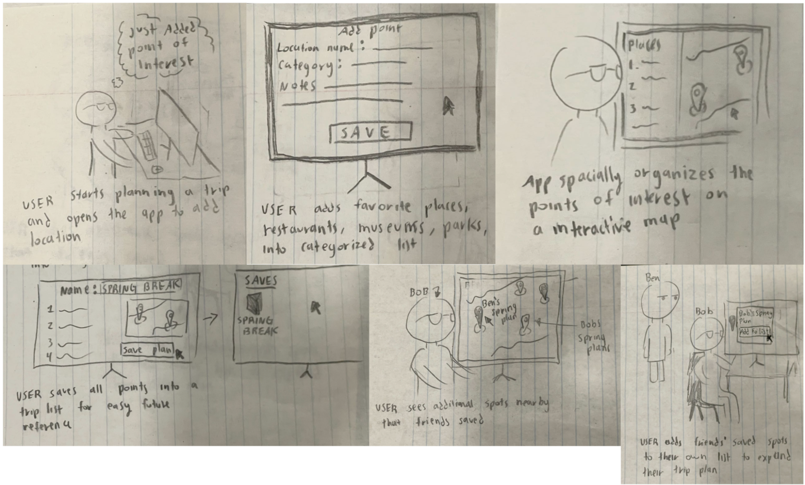
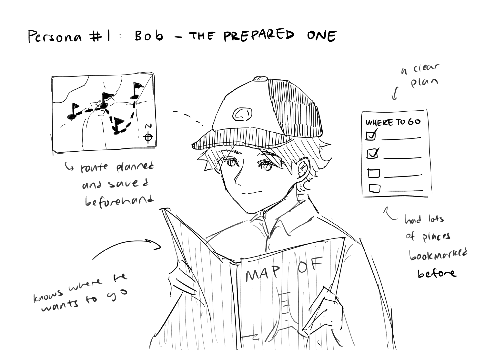
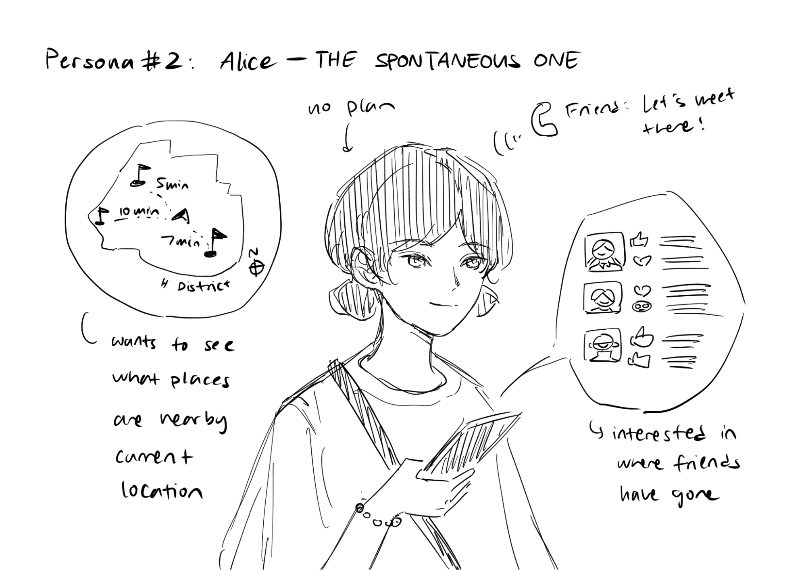
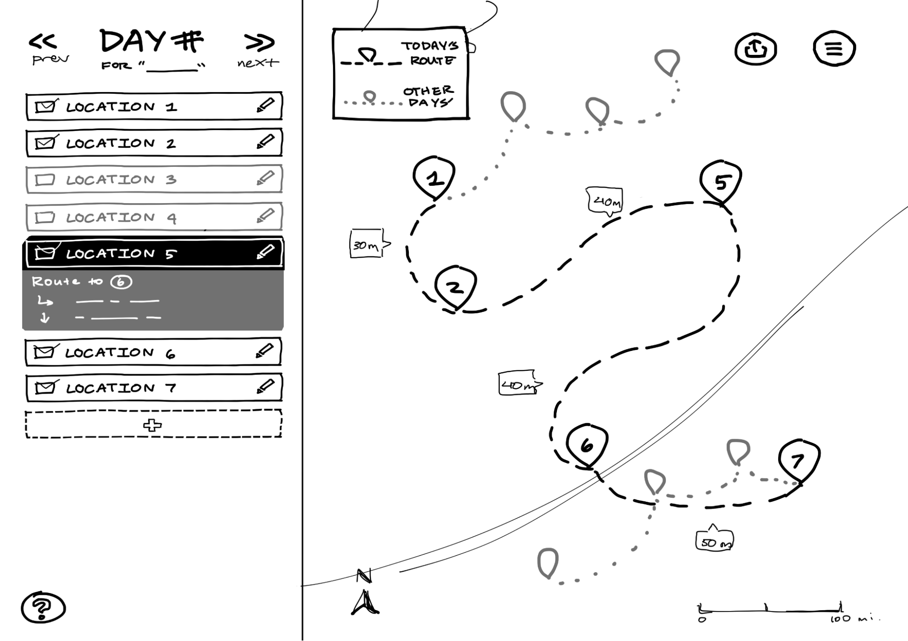
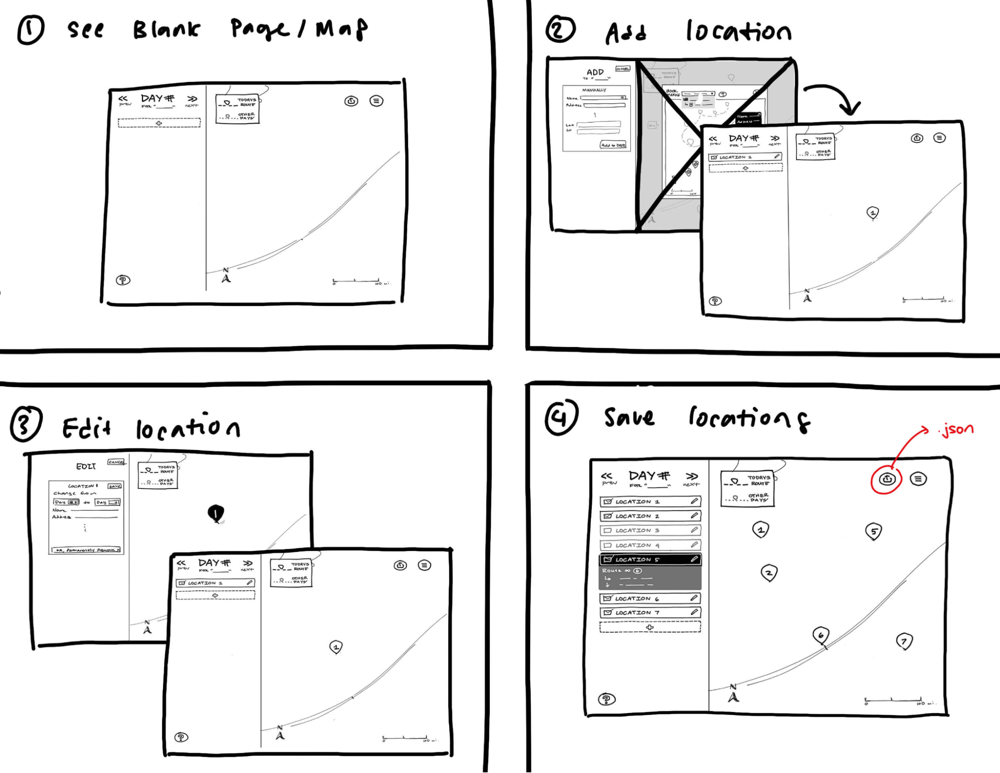
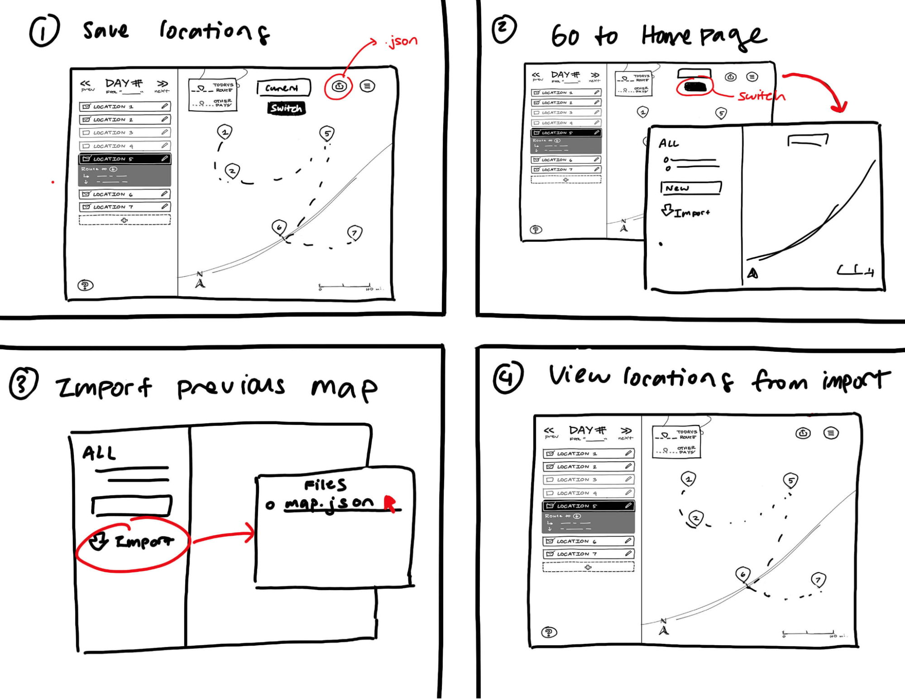
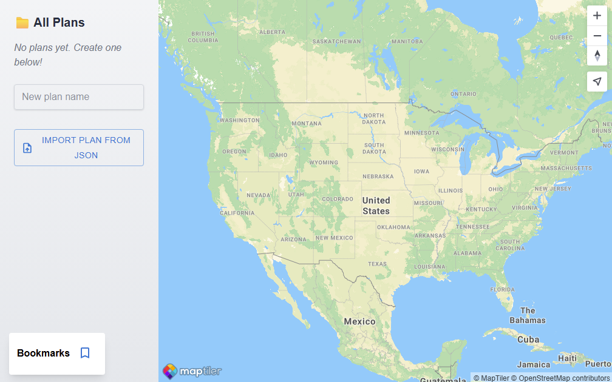
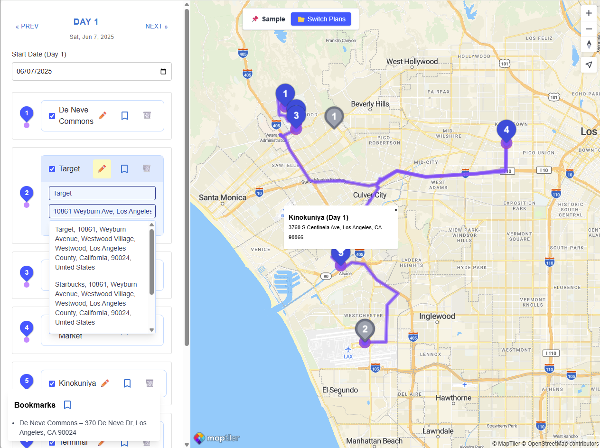

# blog post
### Introduction 
When most people think about traveling, they imagine the fun parts: visiting cool places, trying new food, and exploring cities. But what often gets overlooked is how much planning goes into making a trip actually happen. From figuring out where to go and what to do each day, to coordinating with friends, to making sure everything fits together logistically, planning a trip can quickly become a stressful and disorganized process.

We noticed this problem ourselves as students who enjoy traveling but constantly struggled with how fragmented the planning process felt. There is no one app that helps you do it all. People end up using Google Maps to save places, a notes app to jot down ideas, a spreadsheet to organize days, and a group chat to collect input from friends. Each of these tools serves a purpose, but the bigger issue is that they are not connected. Users have to mentally piece things together, like figuring out if their saved locations on Google Maps are even near each other or how to fit everything into a single day without wasting time moving back and forth across a city.

On top of that, one of the most common issues people face is accidentally losing progress. Google Maps, for instance, might clear your route if you’re not careful, and unless you screenshot or save things somewhere else, all your planning effort can be lost. This not only wastes time but also adds unnecessary stress, especially when you're close to the trip date and trying to finalize details.

We wanted to build something that addressed all of this, a trip planning tool that actually helps people stay organized without forcing them to change how they already think about travel. Our app allows users to pin locations on a map, assign them to specific days, and visualize how everything fits together spatially. Rather than jumping between multiple tools and trying to keep track of things manually, users can do it all in one place with a clean, persistent interface. Nothing gets lost, and the process feels much more natural.

We also took inspiration from our own experiences planning trips in groups. Sometimes you are the person organizing everything, and sometimes you are just along for the ride. Either way, it can be frustrating when it is hard to share plans or give input. We are not trying to turn our app into a social media platform or a fully collaborative workspace, but we do want to make it easier to share recommendations, import parts of someone else’s trip, or simply see what your friends have done in the same city. Planning a trip should feel flexible and empowering, not rigid and stressful.

So instead of creating yet another checklist tool or a detailed itinerary builder that locks users into fixed schedules, we focused on building an adaptable planner that supports different types of travelers. Whether someone wants to fully map out their days before leaving or prefers to figure things out while on the trip, our app gives them the structure and tools to do that on their own terms.

 

### Problem Statement
Through several rounds of user interviews and feedback sessions, we found that one of the biggest frustrations people have with trip planning is that their current tools do not support the way they actually think. Most users do not want to just make a list of places but instead they want to understand how those places relate to each other across space and time. For example, users told us that they often save restaurants, museums, and parks on Google Maps but then feel stuck when it comes to deciding which ones to do on the same day or what the best order is. There is no easy way to see how far apart things are or how much time they will need in between stops.

This lack of connection between location and scheduling leads to a lot of manual work. Users described switching between tabs to check opening hours, copying addresses into different apps to calculate travel time, and using trial and error to build a plan that works. It is time-consuming and often frustrating, especially when changes need to be made on the fly. And while some people enjoy making detailed plans, others just want a basic structure that allows them to explore without feeling lost. Most existing tools don’t support both of these needs at once.

We also realized that although group trips are common, people do not always want or need real-time collaboration. A lot of apps assume that group planning means everyone editing the same plan together, but our research showed that most users prefer a model where one or two people take the lead and others give suggestions. Users told us that it is more helpful to be able to borrow from someone else’s plan, like copying a friend’s list of saved places, than to coordinate everything live. Based on this, we focused our design on supporting individual control with optional peer input. For example, users can import a list of places from someone else’s trip and then make their own edits, without affecting the original.

Another common issue we discovered is that existing tools often feel overwhelming. Even though people want to be organized, they also want the process to feel simple and not like another job. One comment we received during critique sessions was that planning burnout is real, and it would help if the app could communicate when a plan is becoming unrealistic. This made us think more about the emotional side of user experience, not just the functional one. Based on that feedback, we started thinking about how to design features that promote a sense of clarity and calm. While we are still exploring different approaches, our goal is to help users build realistic plans by showing everything in one place, reducing the need to constantly double-check times, locations, or feasibility across multiple tools. By simplifying the planning view and reducing clutter, we hope users will feel more in control and less stressed throughout the process.

Ultimately, the problem is that most trip-planning tools are either too basic or too rigid. They do not provide enough context to help people make good decisions, and they don’t adapt to different planning styles. Our app is meant to bridge that gap. It gives users a way to organize their ideas visually, keep their plans persistent and accessible, and move between structure and flexibility as needed. By focusing on the actual pain points users face, from lost progress and lack of map integration to the stress of building realistic routes, we believe our system offers a more thoughtful and supportive approach to planning travel. Instead of treating planning as something purely functional, we are designing a tool that treats it as an experience, something that should feel empowering, personal, and even fun.

### User Research

Our initial user research focused on uncovering the individual and group challenges travelers face in planning trips. We conducted semi-structured interviews and developed personas, scenarios, and process maps to synthesize our findings. From this, we identified three main challenges: information overload, fear of missing out, and the challenge of organizing with groups. However, peer and course staff feedback offered valuable new perspectives that pushed our design thinking even further.

One of the main insights from the crit session was that the feeling of being overwhelmed is not just a functional problem but an emotional one. While our early framing had been directed towards sorting and categorizing information, the staff challenged us to more directly address the anxiety that users feel when plans get out of control. For instance, one staff recommendation was to use visual cues like a path turning red when a day's schedule is getting too full. Not only does this promote realism in daily planning, but it also communicates potential burnout risk in a subtle, UX-friendly way. Going forward, we'd like to create features that make users feel more in charge, rather than simply more organized.

A second key piece of feedback was to explain the underlying design philosophy of our tool. While we understood that "sorting and processing" points of interest was the crux of the matter, feedback enabled us to probe deeper: what is it about this sorting that is difficult? In hindsight, users are often unable to aggregate location information across time and space. This includes comparing hours of operation, estimating travel time between places, and coordinating weakly-related bookmarks across tens of browser tabs. We're now thinking of our interface not just as a spatial tool (i.e., pinning points on a map), but as a spatiotemporal organizer that bridges between day-level granularity and geographic flow. By doing this, we can help users move from fragmented ideas to actionable, daily plans.

At the philosophical planning stage, the feedback prompted us to acknowledge and support two divergent workflows: structured planners like "Bob" and spontaneous explorers like "Alice." The majority of apps available on the market currently only cater to one of these extremes. Our website aims to be adaptive and enable users to pre-plan itineraries if they wish, or uncover shared, suggested locations dynamically throughout the trip. A particularly valuable comment from one crit participant was the importance of being able to view a friend's favorite location and effortlessly incorporate it into their own itinerary. This validated our concept to enable lightweight social overlays (e.g., bringing in locations from other people), without requiring synchronous collaboration.

  

Lastly, peers and staff reminded us that while collaborative planning is nice to have, it is not always a core feature. In fact, our research revealed many users shy away from full-on group editing because it can be chaotic. Instead of forcing real-time coordination, we’ll prioritize individual control with optional peer input, enabling users to “adopt” plans from others while maintaining their own preferences.

Overall, the feedback has helped us to focus our direction, halfway between emotional clarity and design technicality. We now see our app as not just a planning tool, but a calming, versatile support that frees up the user, however they travel.

### Design Goals

 

_Interface Design_

Our initial work revealed three fundamental user concerns: managing massive volumes of information, minimizing lost opportunities, and balancing group inputs without tension. While these helped guide the early trajectory of our system, feedback from the crit session as well as course instructors prompted us to expand our design goals, not simply in what we're creating, but why our system must accomplish what it accomplishes for different kinds of travelers.

The primary takeaway from our feedback was the importance of specificity: What exactly makes trip planning difficult? What kind of structure are users looking for, and how does our interface support it? In response, we’ve updated our design goals to reflect a more focused and experience-driven perspective:

1. Help users turn scattered points of interest into realistic, daily travel plans.
Travelers collect high-potential spots incrementally, via Instagram stories, blogs, Google Maps pinning, or group chats, but cannot organize them into a meaningful plan of action. Our site aims to make this easier by enabling users to cluster and prioritize places by location, opening hours, and personal preference. Staff recommendations integrated, we will also help users visualize feasibility (e.g., recognizing days with too many destinations) to avoid the danger of itineraries overwhelming and the associated stress.

2. Support formal and informal planning styles.
Feedback determined that our system has to support a variety of planning styles. There are individuals who ("Bob") require highly formalized days, but others ("Alice") prefer to plan informally. Rather than imposing one model, our system will provide users with the ability to build plans at different levels of granularity, ranging from pre-trip route building to in-trip discovery. For instance, they can anchor with pinned activities and leave room for spontaneous additions, or start over and add places in the middle.

3. Reduce the mental overhead of collaborative planning.
Even though we initially assumed that collaboration was a key feature, our interviews and feedback from staff challenged this. Users avoid real-time collaborative editing because of the difficulty in coordination. They prefer to share links or import pieces of other people's plans. Our design supports lightweight collaboration by allowing shared maps, imported plans, and selective copying of locations without requiring live group consensus or shared editing sessions.

4. Provide spatial and temporal context without crowding the interface.
One of the teacher comments led us to realize that planning gets hard not necessarily because of the amount of information, but simply because users tend to switch around between tools and tabs in an attempt to get a sense of where and when something can happen. Our interface will attempt to combine this mental workload by providing one spatial-temporal view. Features like color-coded day blocks, timeline sliders, and map clustering will allow users to stay oriented while building or updating their itinerary.

5. Empower users with peaceful, natural design.
A few reviewers noted that alleviating user stress must be an intentional aspect of our design. This challenged us to think about UX not only in terms of functionality but as emotional experience. For instance, visual cues for over-scheduled days, ambient indications of progress (e.g., "2 of 3 days planned"), and motivational micro-interactions will reinforce feelings of control and accomplishment. The interface itself must be welcoming, even when performing rigorous planning tasks.

Together, these goals form the foundation of a system that supports diverse planning styles of travelers, enables sense-making from disparate data, and imposes structure in a non-rigid manner.

 

_Interaction flow 1: adding/editing locations to the map_

 

_Interaction flow 2: importing/exporting plan_

### System Design and Implementation

 

_Final interfaces_

Our system was implemented using React and MapLibre GL JS (a web-mapping library), and we have the application deployed on Github Pages. 

Our system consists of two main components. The first one is a home page, which is where the user starts upon opening up the application. The home page consists of the following features:
- The user can **create a new plan** from scratch and name it whatever they like.
- The user can **import a plan from json** that they or someone else previously exported from our interface and begin working with that plan instead.

The second component is the main map making interface, which is where the user will spend most of the time in to make their multi-day travel plans and map their day-to-day routes. This interface consists of the following features:
- The user can **add days to the route** by clicking on “NEXT >>” in the top-right corner of the side panel. These days will be labeled with the according date if the user specifies a starting date and otherwise remain unlabelled.
- The user can **add a new location** to a chosen day of the route by manually inputting an address. The user can label the location with a name of the choice, and the address for it can be selected from a dropdown list of addresses via search query. The locations the user adds will be displayed on the map as pinpoints labelled with their order in the list and connected by route information. On click, the pinpoints will also show the same label/address that the user inputted earlier as well as the day the location belongs to.
- The user can **add a location from bookmarks** to a chosen day of the route. We implemented this feature because during a trip, people often need to return to one location multiple times (e.g. the hotel they’re staying at, the nearby train station, etc.). This allows the user to not have to re-input the same name/address for a location multiple times. These locations are displayed the same way as those manually inputted via address.
- The user can **add a location to their bookmarks list** so that they can later add these locations from bookmarks later, as described in the previous bullet point.
- After adding a location, the user can also **edit the location’s label or address** if they realize either entry should be something else.
- By default, only the location’s label and its order in the list is displayed in the side panel view. The user can **view additional location information** by clicking on the location, which will expand the card to display other information, which currently only includes address information. We originally intended for the user to be able to add annotations, but we did not end up having the time to discuss what this should look like.
- The user can **temporarily remove locations** from chosen day of route by unchecking its according card on the side panel. We chose to include a temporary removal option instead of only having a permanent deletion option because we found when creating trip plans, both we and many individuals that we interviewed often want to quickly compare routes by adding or removing locations, which permanent deletion interferes with since it slows down the process when you have to manually input a location again to add it to the route.
- We also included the feature to let users **permanently remove locations** from the chosen day of route to declutter locations that they know they don’t want in their plan anymore.
- The user can **export their finished plan to a json** that they or another user can later import into our map interface. We didn’t want to make users have to do something like create an account or login to the application since we didn’t find that necessary, and some users also specifically cited their annoyance at apps that do this since such tasks require additional time and an Internet connection. As a result, this feature allows for persistence, and it also makes it possible for users to share their plans with each other.
- The user can **reset the plan for a chosen day** instead of manually removing every location.

### Evaluation
For our system, we were most interested in identifying the answers to two key questions:
1. What are the most significant obstacles in using our current application? For this question, we were most interested in identifying UI components that were non-intuitive to use or buggy that we as developers would have a hard time identifying due to our familiarity with the system.
2. What are the reasons that someone will still use other apps over ours? Because we are familiar with the plethora of existing travel and mapping applications that already exist from both our personal experience and from user research responses, we wanted to see if users agreed with us in that our application fulfills a niche use case for mapping and routing visualizations that we thought could be improved on in many travel apps.

To obtain answers to these two questions, we conducted semi-structured interviews with users and asked them to first complete the following tasks to test our system: 

- Make a plan for Day 1 by adding/removing locations.
- Try making a plan for a new day.
- Try downloading a plan.
- Try importing a plan.

Then, we would proceed to ask them the following questions:

- What do you think was the hardest part of using this application?
- What features about our application did you like?
- Would you use this over apps, and if not, why would you use other apps over this still?
- Any final comments?

During the interview, we identified and took notes on the process/steps by which the user makes a plan. We observed the features that users liked or disliked as well as how many times we had to intervene and show the user how to do something. After the first round of interviews that we conducted, we created a codebook to highlight these key observations about the features that users liked, disliked, and struggled with the most. This made it easier for us to notice commonalities between user interviews, especially not all of us were present for all interviews conducted. For example, we all found a couple of UI difficulties that participants ran into, like the noticeability of certain components, that we worked to improve on between the time we had to conduct user research and the final project showcase.

### Findings
Overall, we found that users responded positively to the UI and functionality of our system. Many users noted that they liked the route visualization and clarity of the geography. Specifically, users generally had positive reactions to the routing/pathfinding between pinpoints. The visual representation of estimated pinpoint distance contributed to users’ understanding and confidence in their created itineraries. 

Furthermore, users tended to enjoy the bookmarks system. Although they often required the interviewer to point out the feature, users found that bookmarks were helpful in revisiting specific repeat locations. They also enjoyed the download/import functionality. Unlike bookmarks, almost all users were successfully able to both download their current plan and import pre-existing plans without requiring prompting from the interviewer. Users also saw value in the system in implementing high-level itinerary planning, for instance as a complementary tool alongside more realtime and/or more exploratory applications such as Google Maps.

In addition to the above positive feedback, we did also observe several usability issues and friction points:

- Map Interactivity: There was a discrepancy between some users’ expectations about map interactivity and our actual design. These users tried to add new locations directly by clicking on the map, which our design does not support. 

- Search UI: Multiple users encountered ambiguities or failures of our location search interface. A notable example is when one user searched for “Chicago pizza” after previously adding pinpoints in Chicago, but did not receive any search results which were actually pizza restaurants in Chicago. They (in addition to several other users) suggested that our search should take into account where currently placed pinpoints are, and sort search queries based on distance from points in the current plan/day. Another user expressed that the dropdown menus and search UI were confusing to navigate.

- Multi-day Routing and Itinerary Clarity: Some participants expressed a desire for better routing across multiple days. Notably, they wanted the website to create a routing link between the final location of one day and the starting location of the next day. Additionally, users expressed visual confusion when the same location(s) appeared across multiple days, as the UI did not clearly differentiate or contextualize overlapping pinpoints or overlapping routes. 

- Bookmarks: Only a few users were able to discover the bookmarks feature while exploring our system without explicit prompting from the interviewer. While users saw a lot of value in this feature when introduced, the poor discoverability hinders its effectiveness. Additionally, most users noted that bookmarks list UI was poor, as when the list held multiple entries, it visually obstructed other UI elements. We addressed the UI covering issue in a subsequent patch. 

- Reordering Limitations: Users expressed a desire for more flexible ordering of locations within a day. While reordering was possible via the view-toggle-based system, many users found it limiting and unintuitive, although one user appreciated the novelty of its “queue”-like nature. When asked, users responded that a drag-and-drop reordering system would be preferable. 

- Other Miscellaneous: Other minor usability concerns included low-contrast text, unclear buttons, and API latency. For the latter, some users were unsure whether their user input (searching, adding a location, etc.) had been registered due to the lack of haptic or visual feedback. 

## Discussion 
_Key Takeways_:
1. Users liked the route visualization feature, downloading/importing plans, and planning by day. These features helped users conceptualize and visualize their itineraries over multiple days, and were seen as the key contributions of our system compared to similar planning tool alternatives.

2. Bookmarks were a useful feature when understood, but had poor discoverability and suffered some UI limitations. Bookmarks were received well and seen as highly useful for managing repeat points of interest. 
 
3. Users most frequently experienced friction when adding locations to the map, affected by search UI, limited reordering, and inter-day routing ambiguity. These issues stood in the way of a more seamless user experience for the itinerary-creation interaction flow and the design relating to these should be reconsidered in accordance to user pain points. 

4. Users used and referenced Google Maps (positively) but appreciated that our system could be used as a complement to their current planning process. They acknowledged that while Google Maps remained significantly more practical for navigation, exploration, and real-time directions, our tool offered a unique framework for high-level planning. They could see themselves using our tool as a complementary tool in their travel workflow. 

_Limitations_

Methodologically, our user pool was largely composed of individuals who are UCLA students with computer science or computing related academic majors, primarily due to convenience sampling. It is possible that this background made users more familiar with technical interfaces like ours and may not reflect our target users, whose experience with technical interfaces may be closer to that of the broader population’s. Furthermore, our evaluation process included intervention from interviewers that was dynamic and not standardized, notably prompting users to explore features like bookmarks and import/export when users did not discover these features organically. This may have caused users’ first impressions of some features to be skewed, or vary from user to user. Lastly, in most sessions, the user did not have a clear travel destination already in mind, leading some of them to create vague or unrealistic plans, which likely does not reflect how users would engage with our system in real-world travel scenarios.  

_Future Work_

In addition to conducting more user testing addressing our methodological limitations, future work could involve modifying the design to allow for more flexible reordering and to add inter-day transitions and distinguish overlapping points between days via point grouping or labeling mechanisms. Regarding functionality, we could redesign the search UI to improve clarity and make it so that the search results are context-aware, for instance returning localized results based on the current locations in the plan or the current map view window. We could also make it so that the user is able to add points directly by clicking on a location in the map, or support a recommendation system so that users are able to explore nearby locations without leaving our system. 

_Lessons Learned and New Questions_

From our evaluation, we learned that feature discovery is not a guarantee, even if the feature itself is motivated and useful. Assumptions about feature discoverability need to be validated via user testing. Additionally, users come in with presuppositions about how systems should work based on how they interact with existing tools. In our case, users were expecting to be able to interact with our system similarly to how they interact with Google Maps. Thus, it is important to observe how designs align with or diverge from these existing systems, and consider how potential discrepancies could affect the usability of a system. 

New questions about our system include: How do users behave when ideating the trip, planning destinations before the trip, and planning on the go? How can we make core features of our system discoverable without frontloading the user with information? How can our system integrate more directly with platforms like Google maps or external calendar systems? How would we streamline or expand upon the collaborative or sharing aspect of our current system? 
